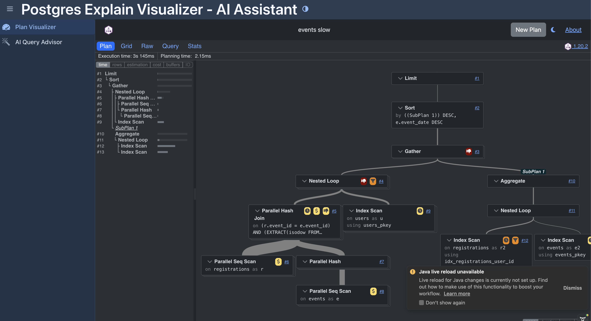

# PEV2 Spring Boot Backend

This project integrates the [PEV2](https://github.com/dalibo/PEV2) PostgreSQL Explain Visualizer with a Spring Boot backend, featuring Spring AI (Ollama) for intelligent query analysis.

## Features

- **Plan Visualizer:** Embeds the PEV2 frontend to visualize PostgreSQL execution plans.
- **AI Query Advisor:** Uses Ollama to analyze table schemas and queries, providing index recommendations and optimization strategies.
- **Vaadin UI:** A modern Java-based web interface.



## Prerequisites

- Java 17+
- Maven
- Node.js (for building PEV2)
- [Ollama](https://ollama.ai/) running locally (default port 11434).

## Setup

1.  **Build PEV2 Frontend:**
    The `PEV2` project needs to be built and its static assets copied to this project.
    ```bash
    cd ../PEV2
    npm install
    npm run build
    # Copy the built app to the Spring Boot static resources
    cp -r dist-app/* ../pev-spring/src/main/resources/static/PEV2/
    ```

2.  **Run Ollama:**
    Ensure Ollama is running and has a model pulled (e.g., `llama2` or `mistral`).
    ```bash
    ollama serve
    ollama pull mistral
    ```
    *Note: You may need to configure the model name in `application.properties` if not using the default.*

3.  **Run Spring Boot App:**
    ```bash
    cd ../pev-spring
    mvn spring-boot:run
    ```

4.  **Access the App:**
    Open [http://localhost:8080](http://localhost:8080) in your browser.

## Configuration

You can configure the Ollama base URL and model in `src/main/resources/application.properties` (create if missing):

```properties
spring.ai.ollama.base-url=http://localhost:11434
spring.ai.ollama.chat.model=gpt-oss:20bs
```

